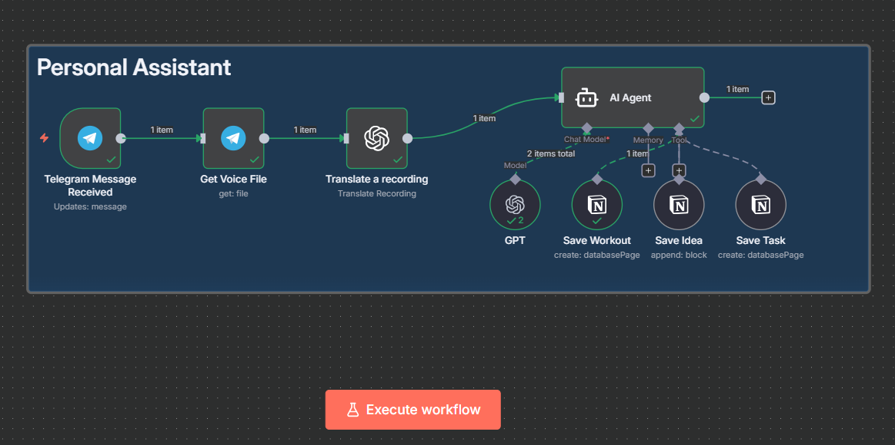

# Voice-Driven Personal Assistant (n8n + Cloud Run)

This project uses [n8n](https://n8n.io) to automate voice-driven task and life management, integrating Telegram, OpenAI, and Notion.

The core functionality involves capturing voice messages and interpreting their intent (Workout, Idea, Task), then routing the data to the appropriate Notion destination.

## Workflow

The project automates voice-driven task management through a defined sequence:
- Telegram Voice Messages are Received: The workflow is initiated by a message received via the Telegram Bot API.
- Voice File Retrieval and Transcription: The message includes a voice message file. This file is retrieved using a Get Voice File node and is then transcribed/translated into text using an OpenAI node (or similar translation node).
- AI Agent Intent Interpretation: The transcribed text is sent to an AI Agent (GPT). The agent determines the user's intent, classifying the request into one of three Notion actions: Workout, Idea, or Task.
- Actions are Routed to Notion: Based on the intent, the data is routed to Notion using specific n8n nodes for precise data logging.

## APIs
- Telegram Bot API

- OpenAI API

- Notion Integration Token

## Deployment
Deployed on Google Cloud Run

